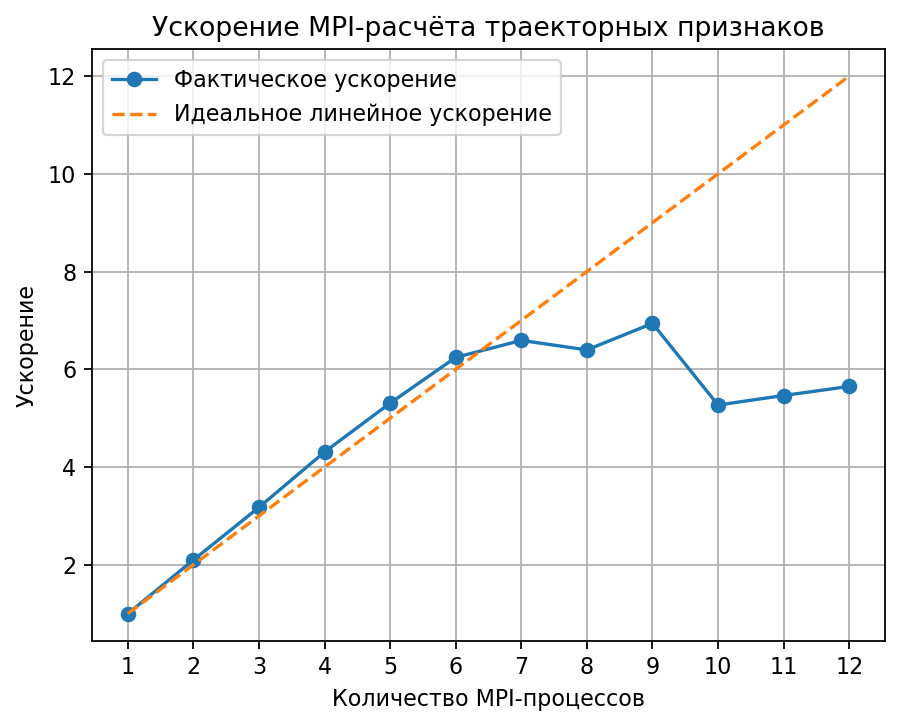
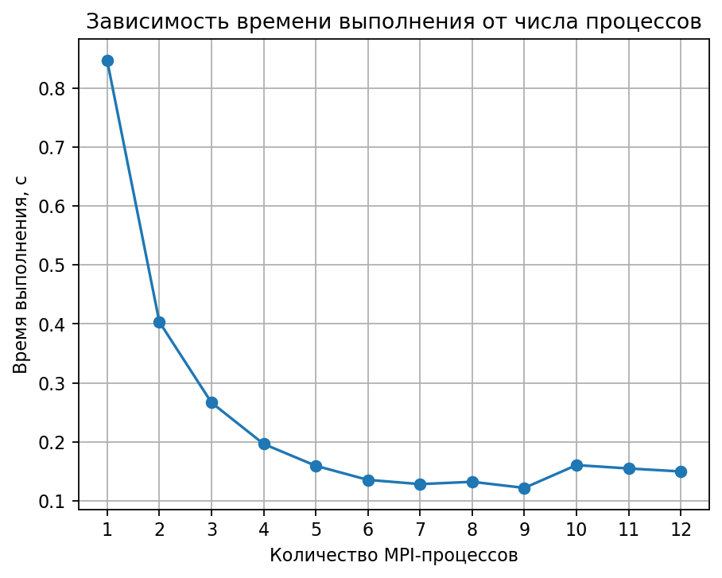
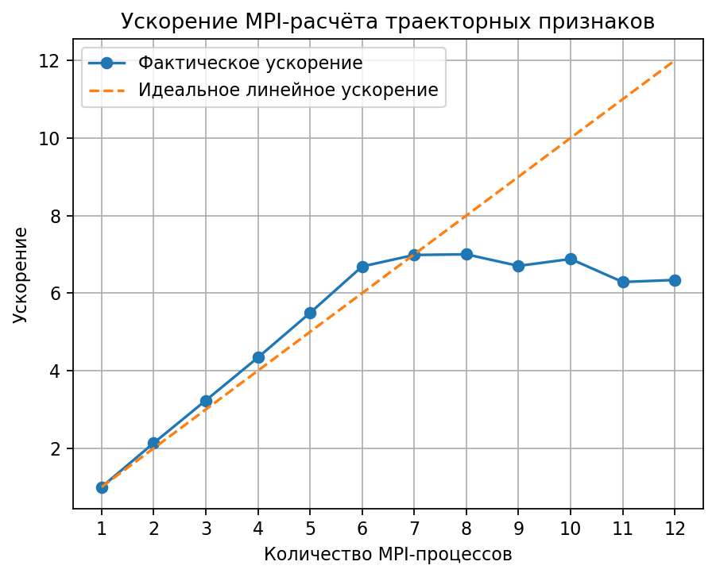

# Распределённый расчёт траекторных признаков воздушных объектов

Проект предназначен для предобработки траекторных признаков воздушных объектов. На вход подаётся CSV-файл с точками траекторий, после чего для каждой траектории рассчитывается набор статистических признаков. Полученные признаки могут использоваться в валидационном модуле для дальнейшего траекторного анализа и классификации объектов.

## О проекте

Входной файл содержит точки траекторий в формате (это пример):

```csv
category,record_index,element_index,v,h
plane,0,0,46.213421,224.914215
```

Где:

- `category` - тип воздушного объекта;
- `record_index` - номер траектории внутри класса;
- `element_index` - номер точки внутри траектории;
- `v` - скорость;
- `h` - высота.

Траектория определяется парой `category + record_index`. Для каждой траектории рассчитываются признаки:

- `hmin` - минимальная высота;
- `hmax` - максимальная высота;
- `haverage` - средняя высота;
- `vmin` - минимальная скорость;
- `vmax` - максимальная скорость;
- `vaverage` - средняя скорость;
- `point_count` - количество точек траектории;
- `hrange` - диапазон высоты;
- `vrange` - диапазон скорости.

## Структура проекта

```text
mpi_trajectory_features/
├── CMakeLists.txt
├── README.md
├── include/
│   ├── benchmark.hpp
│   ├── csv_reader.hpp
│   ├── distributed_processor.hpp
│   └── trajectory_stats.hpp
├── src/
│   ├── benchmark.cpp
│   ├── csv_reader.cpp
│   ├── distributed_processor.cpp
│   ├── main.cpp
│   └── trajectory_stats.cpp
├── data/
│   ├── sample_air_objects.csv
│   └── generated/
├── scripts/
│   ├── generate_dataset.py
│   ├── plot_results.py
│   ├── run_benchmarks.ps1
│   └── run_benchmarks.sh
└── docs/
    ├── performance/
    │   ├── benchmark_results.csv
    │   ├── benchmark_summary.csv
    │   ├── speedup.png
    │   └── time.png
    └── old_performance/
        ├── benchmark_results.csv
        ├── benchmark_summary.csv
        ├── speedup.png
        └── time.png
```

## Алгоритм работы

1. Процесс rank = 0 считывает входной CSV-файл.
2. Строки входного файла преобразуются во внутреннее числовое представление.
3. Главный процесс распределяет блоки точек между MPI-процессами.
4. Каждый процесс локально группирует полученные точки по ключу "category + record_index".
5. Для каждой локальной группы рассчитываются частичные статистики: минимумы, максимумы, суммы и количество точек.
6. Частичные результаты собираются на процессе rank = 0.
7. Главный процесс объединяет статистики одинаковых траекторий.
8. Средние значения высоты и скорости вычисляются после объединения сумм и количества точек.
9. Итоговая таблица признаков сохраняется в CSV-файл.


## Требования

Для сборки и запуска проекта необходимы:

- CMake 3.20 или выше;
- компилятор с поддержкой C++17;
- MPI;
- Python 3;
- внешняя библиотека `fmt`;
- `matplotlib` для построения графиков.

## Сборка

Из корня проекта:

```bash
cmake -S . -B build
cmake --build build
```

## Генерация синтетических данных

В проекте используется синтетический набор данных. То есть строки CSV не являются!!! реальными измерениями воздушных объектов, а создаются программно с помощью скрипта (количество траекторий и точек в траектории можно регулировать):

```bash
python3 scripts/generate_dataset.py \
  --output data/generated/air_objects_big.csv \
  --trajectories-per-class 5000 \
  --points-per-trajectory 100
```

Для первого эксперимента были заданы (результаты в docs/old_performance):

```text
4 класса × 5000 траекторий × 100 точек = 2 000 000 точек
```

Затем количество точек было увеличено до 20 млн:
```text
4 класса × 20000 траекторий × 250 точек = 20 000 000 точек
```

Используемые классы:

- `plane`;
- `drone`;
- `helicopter`;
- `balloon`.

Генерация выполняется с фиксированным зерном случайности `random.seed(42)`, чтобы результаты были воспроизводимыми.

Для каждого класса задаётся свой базовый диапазон скорости и высоты. Затем для каждой точки траектории добавляются плавные периодические изменения и случайный шум:

```text
base_v = 35.0 + category_index × 45.0 + (record_index mod 7) × 1.5
base_h = 200.0 + category_index × 900.0 + (record_index mod 11) × 10.0

v = base_v + 8.0 × sin(2πt) + N(0, 1.0)
h = base_h + 120.0 × t + 25.0 × cos(2πt) + N(0, 4.0)
```

Здесь `t` - нормированное положение точки внутри траектории, а `N(0, σ)` - нормально распределённый шум. Благодаря этому данные имеют различия между классами, но остаются искусственными и используются только для проверки производительности распределённой обработки.

## Запуск бенчмарка

Для запуска серии измерений на 1–12 MPI-процессах в 1 эксперименте используется скрипт:

```bash
./scripts/run_benchmarks.sh ./build/mpi_trajectory_features data/generated/air_objects_big.csv
```

Для запуска серии измерений на 1–12 MPI-процессах в 2 эксперименте используется скрипт:

```bash
./scripts/run_benchmarks.sh ./build/mpi_trajectory_features data/generated/air_objects_20m.csv
```

Скрипт последовательно запускает программу на 1, 2, 3, ..., 12 процессах и сохраняет результаты в:

```text
docs/performance/benchmark_results.csv
docs/performance/benchmark_summary.csv
```

После этого автоматически строятся графики:

```text
docs/performance/time.png
docs/performance/speedup.png
```

## Как измеряется ускорение

Для каждого количества процессов фиксировалось лучшее время выполнения. Ускорение и эффективность рассчитывались по формулам:

```text
Speedup(p) = T(1) / T(p)
Efficiency(p) = Speedup(p) / p × 100%
```

Где:

- `T(1)` - время выполнения на одном MPI-процессе;
- `T(p)` - время выполнения на `p` MPI-процессах.

## Полученные результаты

## Эксперимент 1: 2 млн точек

### 1. Системная конфигурация

| Параметр | Значение |
|---|---|
| Устройство | MacBook M1 Pro |
| Архитектура | ARM64, Apple Silicon |
| Операционная система | macOS |
| MPI-реализация | OpenMPI |
| Язык реализации | C++17 |
| Система сборки | CMake |
| Набор данных | Синтетический CSV |
| Количество точек | 2 000 000 |
| Количество траекторий | 20 000 |
| Число классов | 4 |
| Диапазон запусков | 1–12 MPI-процессов |

### 2. Методика измерений

- Для тестирования использовался синтетический файл `data/generated/air_objects_big.csv`.
- В каждом запуске обрабатывалось `2 000 000` точек.
- Для каждого числа процессов от 1 до 12 фиксировалось лучшее время выполнения.
- Корректность MPI-результата проверялась с помощью параметра `--verify`.
- Во всех запусках проверка завершилась со статусом `Verification: OK`.
- Ускорение рассчитывалось относительно времени выполнения на одном MPI-процессе.

### 3. Таблица результатов

| MPI-процессы | Время выполнения, с | Ускорение | Эффективность, % |
|---:|---:|---:|---:|
| 1 | 0.846749 | 1.000 | 100.0 |
| 2 | 0.403569 | 2.098 | 104.9 |
| 3 | 0.266661 | 3.175 | 105.8 |
| 4 | 0.196564 | 4.308 | 107.7 |
| 5 | 0.159526 | 5.308 | 106.2 |
| 6 | 0.135621 | 6.243 | 104.1 |
| 7 | 0.128461 | 6.591 | 94.2 |
| 8 | 0.132362 | 6.397 | 80.0 |
| 9 | 0.122015 | 6.940 | 77.1 |
| 10 | 0.160689 | 5.269 | 52.7 |
| 11 | 0.154965 | 5.464 | 49.7 |
| 12 | 0.149879 | 5.650 | 47.1 |

### 4. Графики

#### Ускорение MPI-расчёта

На графике показано фактическое ускорение MPI-программы и пунктирная линия идеального линейного ускорения.



#### Время выполнения

На графике показана зависимость времени выполнения от количества MPI-процессов.



### 5. Анализ результатов эксперимента 1

При увеличении числа процессов от 1 до 6 наблюдается почти линейное ускорение. В некоторых запусках эффективность немного превышает 100%. Это произошло скорее всего из-за малого времени выполнения, фоновой нагрузки и/или погрешности измерений.

Наилучший результат был получен при запуске на 9 MPI-процессах:

```text
Время выполнения: 0.122015 с
Ускорение: 6.940×
```

После 9 процессов ускорение перестаёт расти, а при 10–12 процессах наблюдается снижение эффективности. Таким образом, практический максимум ускорения для данного запуска достигается раньше, чем число процессов становится равным 12. 


## Эксперимент 2: 20 млн точек (и тут же использовалась fmt)

### 1. Системная конфигурация

| Параметр | Значение |
|---|---|
| Устройство | MacBook M1 Pro |
| Архитектура | ARM64, Apple Silicon |
| Операционная система | macOS |
| MPI-реализация | OpenMPI |
| Язык реализации | C++17 |
| Система сборки | CMake |
| Внешняя библиотека | fmt |
| Набор данных | Синтетический CSV |
| Количество точек | 20 000 000 |
| Количество траекторий | 80 000 |
| Число классов | 4 |
| Диапазон запусков | 1–12 MPI-процессов |

### 2. Методика измерений

- Для тестирования использовался синтетический файл `data/generated/air_objects_20m.csv`.
- В каждом запуске обрабатывалось `20 000 000` точек.
- Для каждого числа процессов от 1 до 12 фиксировалось лучшее время выполнения.
- Корректность MPI-результата проверялась с помощью параметра `--verify`.
- Во всех запусках проверка завершилась со статусом `Verification: OK`.
- Ускорение рассчитывалось относительно времени выполнения на одном MPI-процессе.

### 3. Таблица результатов

| MPI-процессы | Время выполнения, с | Ускорение | Эффективность, % |
|---:|---:|---:|---:|
| 1 | 9.281160 | 1.000 | 100.0 |
| 2 | 4.348700 | 2.134 | 106.7 |
| 3 | 2.870600 | 3.233 | 107.8 |
| 4 | 2.139110 | 4.339 | 108.5 |
| 5 | 1.690650 | 5.490 | 109.8 |
| 6 | 1.387880 | 6.687 | 111.5 |
| 7 | 1.328990 | 6.984 | 99.8 |
| 8 | 1.325950 | 7.000 | 87.5 |
| 9 | 1.384900 | 6.702 | 74.5 |
| 10 | 1.349080 | 6.880 | 68.8 |
| 11 | 1.476410 | 6.286 | 57.1 |
| 12 | 1.464210 | 6.339 | 52.8 |

### 4. Графики

#### Ускорение MPI-расчёта

На графике показано фактическое ускорение MPI-программы и пунктирная линия идеального линейного ускорения.



#### Время выполнения

На графике показана зависимость времени выполнения от количества MPI-процессов.


### 5. Анализ результатов эксперимента 2

После увеличения объёма данных до 20 млн точек время выполнения на одном MPI-процессе составило `9.281160` с. Это делает измерения более релевантными, чем в предыдущем эксперименте на 2 млн точек, где время выполнения было меньше одной секунды и находилось ближе к уровню систематической погрешности.

При увеличении числа процессов от 1 до 6 наблюдается почти линейное ускорение. На 6 процессах время выполнения снизилось до `1.387880` с, а ускорение составило `6.687×`.

После 7–8 процессов ускорение выходит на плато. При запуске на 9–12 процессах дальнейшего устойчивого роста не наблюдается. 

Наилучшее время в данном эксперименте получено при запуске на 8 MPI-процессах:

```text
Время выполнения: 1.325950 с
Ускорение: 7.000×
```


## Выводы

1. Реализованный MPI-модуль успешно выполняет распределённый расчёт траекторных признаков для CSV-файла с большим количеством точек.
2. Синтетический набор данных позволяет воспроизводимо проверять производительность алгоритма без использования реальных данных.
3. Переход от одного процесса к нескольким даёт существенное ускорение расчёта.
4. На MacBook M1 Pro лучший результат в данном эксперименте достигнут при 8 MPI-процессах.
5. Увеличение объёма данных с 2 млн до 20 млн точек сделало замеры производительности более релевантными.
6. При дальнейшем увеличении числа процессов эффективность снижается.

